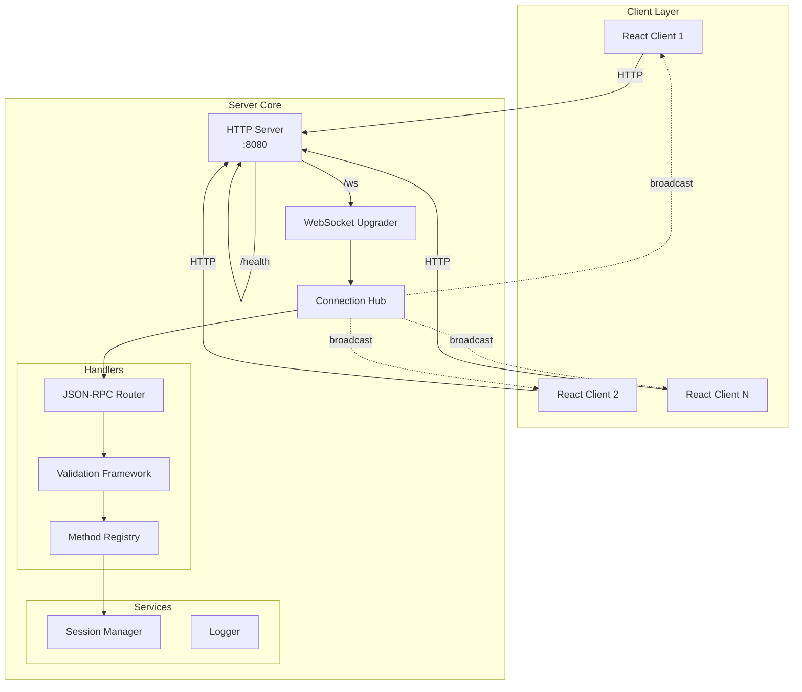
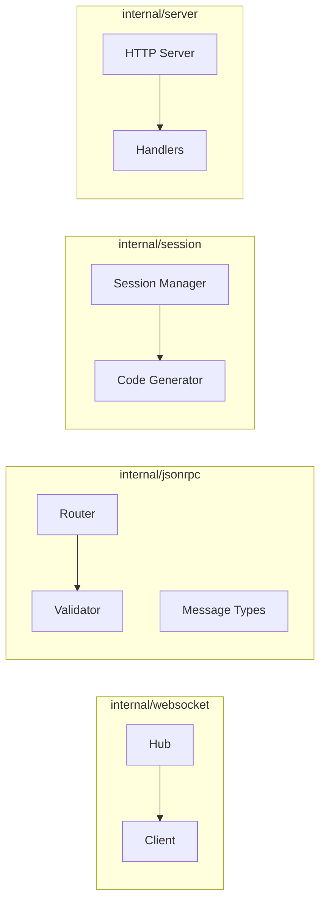
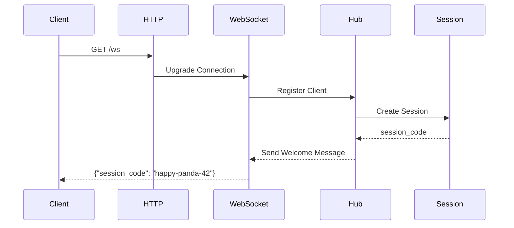
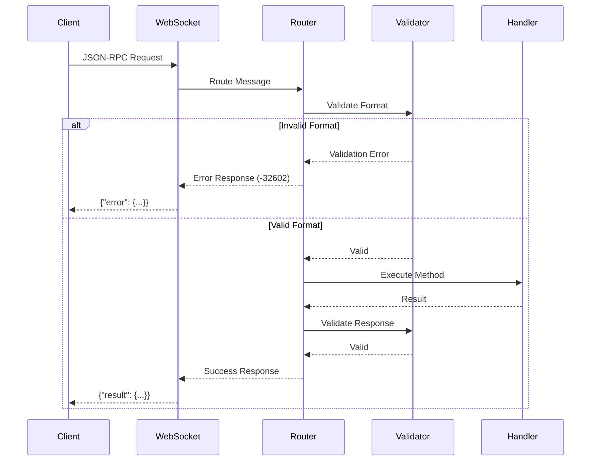

# Design: backend-core

## Overview

The backend-core provides the foundational Go server infrastructure for the FLE platform. This design establishes a WebSocket-based JSON-RPC API server with human-friendly session management, strict message validation, and a hub-based connection management pattern. The architecture is designed to be extensible, allowing future features to register their own methods and handlers while maintaining consistent validation and error handling.

## Architecture

### High-Level Architecture



### Component Architecture



## Components and Interfaces

### 1. HTTP Server (`internal/server/server.go`)

```go
type Server struct {
    hub        *websocket.Hub
    router     *jsonrpc.Router
    config     *Config
    logger     *slog.Logger
}

type Config struct {
    Port        int    `env:"PORT" default:"8080"`
    Host        string `env:"HOST" default:"0.0.0.0"`
    CORSOrigin  string `env:"CORS_ORIGIN" default:"http://localhost:3000"`
    LogLevel    string `env:"LOG_LEVEL" default:"debug"`
    Environment string `env:"ENV" default:"development"`
}

// Main endpoints
func (s *Server) handleWebSocket(w http.ResponseWriter, r *http.Request)
func (s *Server) handleHealth(w http.ResponseWriter, r *http.Request)
```

### 2. WebSocket Hub (`internal/websocket/hub.go`)

```go
type Hub struct {
    clients    map[*Client]bool
    sessions   map[string]*Client  // sessionCode -> client mapping
    broadcast  chan []byte
    register   chan *Client
    unregister chan *Client
    mu         sync.RWMutex
}

type Client struct {
    hub         *Hub
    conn        *websocket.Conn
    send        chan []byte
    sessionCode string
    logger      *slog.Logger
}

// Hub manages all WebSocket connections
func (h *Hub) Run()
func (h *Hub) RegisterClient(client *Client)
func (h *Hub) UnregisterClient(client *Client)
func (h *Hub) SendToSession(sessionCode string, message []byte)
```

### 3. JSON-RPC Router (`internal/jsonrpc/router.go`)

```go
type Router struct {
    methods    map[string]*MethodHandler
    validator  *validator.Validate
    logger     *slog.Logger
}

type MethodHandler struct {
    Name       string
    ParamsType reflect.Type
    ResultType reflect.Type
    Handler    HandlerFunc
    Validator  ValidatorFunc
}

type HandlerFunc func(ctx context.Context, params json.RawMessage) (interface{}, error)
type ValidatorFunc func(params interface{}) error

// Router handles JSON-RPC method registration and execution
func (r *Router) Register(method string, handler *MethodHandler)
func (r *Router) Handle(ctx context.Context, msg *Message) *Response
func (r *Router) ValidateMessage(msg *Message) error
```

### 4. Session Manager (`internal/session/manager.go`)

```go
type SessionManager struct {
    activeSessions map[string]*Session
    mu            sync.RWMutex
    generator     *CodeGenerator
}

type Session struct {
    Code      string    `json:"code"`
    CreatedAt time.Time `json:"createdAt"`
    LastSeen  time.Time `json:"lastSeen"`
    Data      map[string]interface{} `json:"data"`
}

type CodeGenerator struct {
    rand *rand.Rand
}

// Session management
func (sm *SessionManager) CreateSession() (*Session, error)
func (sm *SessionManager) GetSession(code string) (*Session, bool)
func (sm *SessionManager) ValidateSessionCode(code string) bool

// Code generation using golang-petname
func (cg *CodeGenerator) Generate() string
```

## Data Models

### JSON-RPC Message Types (`internal/jsonrpc/types.go`)

```go
// Request represents a JSON-RPC 2.0 request
type Request struct {
    JSONRPC string          `json:"jsonrpc" validate:"required,eq=2.0"`
    ID      interface{}     `json:"id" validate:"required"`
    Method  string          `json:"method" validate:"required,min=1"`
    Params  json.RawMessage `json:"params,omitempty"`
}

// Response represents a JSON-RPC 2.0 response
type Response struct {
    JSONRPC string          `json:"jsonrpc" validate:"required,eq=2.0"`
    ID      interface{}     `json:"id"`
    Result  interface{}     `json:"result,omitempty"`
    Error   *Error          `json:"error,omitempty"`
}

// Error represents a JSON-RPC 2.0 error
type Error struct {
    Code    int         `json:"code"`
    Message string      `json:"message"`
    Data    interface{} `json:"data,omitempty"`
}

// Standard error codes
const (
    ParseError     = -32700
    InvalidRequest = -32600
    MethodNotFound = -32601
    InvalidParams  = -32602
    InternalError  = -32603
)
```

### Validation Tags

```go
// Example of how future features will define their methods
type ExampleMethodParams struct {
    Field1 string `json:"field1" validate:"required,min=3,max=100"`
    Field2 int    `json:"field2" validate:"required,min=0,max=1000"`
    Field3 string `json:"field3" validate:"omitempty,oneof=option1 option2"`
}

// Custom validators for domain-specific rules
func init() {
    // Register custom validator for session codes
    validate.RegisterValidation("session_code", validateSessionCode)
}

func validateSessionCode(fl validator.FieldLevel) bool {
    code := fl.Field().String()
    // Pattern: adjective-animal-number
    pattern := `^[a-z]+-[a-z]+-\d{1,2}$`
    matched, _ := regexp.MatchString(pattern, strings.ToLower(code))
    return matched
}
```

## Message Flow Sequences

### Connection and Session Creation



### JSON-RPC Request Processing



## Error Handling

### Error Categories and Responses

1. **Connection Errors**
   - WebSocket upgrade failures
   - Connection drops
   - Heartbeat timeouts

2. **Protocol Errors**
   - Invalid JSON (-32700 Parse Error)
   - Invalid JSON-RPC format (-32600 Invalid Request)
   - Unknown method (-32601 Method Not Found)
   - Invalid parameters (-32602 Invalid Params)

3. **Validation Errors**
   - Missing required fields
   - Type mismatches
   - Format violations
   - Constraint violations

### Error Response Format

```json
{
  "jsonrpc": "2.0",
  "id": 1,
  "error": {
    "code": -32602,
    "message": "Invalid params",
    "data": {
      "field": "field1",
      "constraint": "min=3",
      "value": "ab",
      "message": "field1 must be at least 3 characters"
    }
  }
}
```

### Panic Recovery

```go
func (c *Client) readPump() {
    defer func() {
        if r := recover(); r != nil {
            c.logger.Error("panic in readPump", 
                "error", r,
                "stack", debug.Stack())
        }
        c.hub.unregister <- c
        c.conn.Close()
    }()
    // ... connection handling
}
```

## Testing Strategy

### Unit Tests

1. **Session Generation**
   - Test uniqueness of generated codes
   - Test collision handling
   - Test case-insensitive validation
   - Test format compliance

2. **JSON-RPC Validation**
   - Test valid message acceptance
   - Test invalid message rejection
   - Test all error codes
   - Test parameter validation

3. **Hub Management**
   - Test concurrent connections
   - Test client registration/unregistration
   - Test message broadcasting
   - Test session-specific messaging

### Integration Tests

1. **WebSocket Flow**
   - Test connection upgrade
   - Test session creation on connect
   - Test reconnection with existing session
   - Test graceful disconnection

2. **Message Processing**
   - Test end-to-end JSON-RPC flow
   - Test validation pipeline
   - Test error propagation
   - Test concurrent requests

### Load Tests

```go
// Example load test
func TestConcurrentConnections(t *testing.T) {
    server := startTestServer()
    defer server.Close()
    
    var wg sync.WaitGroup
    for i := 0; i < 1000; i++ {
        wg.Add(1)
        go func() {
            defer wg.Done()
            client := connectWebSocket(server.URL)
            defer client.Close()
            // Send test messages
            sendJSONRPC(client, "test.echo", map[string]string{"msg": "test"})
        }()
    }
    wg.Wait()
}
```

## Configuration and Deployment

### Environment Variables

```bash
# .env.example
PORT=8080
HOST=0.0.0.0
CORS_ORIGIN=http://localhost:3000
LOG_LEVEL=debug
ENV=development
```

### Makefile Targets

```makefile
# Makefile
.PHONY: build run test clean

build:
	go build -o bin/server cmd/server/main.go

run:
	go run cmd/server/main.go

test:
	go test -v ./...

test-coverage:
	go test -coverprofile=coverage.out ./...
	go tool cover -html=coverage.out

clean:
	rm -rf bin/
```

## Security Considerations

1. **Input Validation**
   - All inputs validated before processing
   - Strict type checking
   - No additional properties allowed
   - SQL injection prevention (for future DB features)

2. **Session Security**
   - Session codes contain no sensitive data
   - Codes are sufficiently random (~111 million combinations)
   - Case-insensitive to prevent user errors
   - No session fixation vulnerabilities

3. **WebSocket Security**
   - CORS configuration for development
   - Origin checking in production
   - Rate limiting per connection (future)
   - Message size limits

## Future Extensibility

The design supports future enhancements:

1. **Method Registration**
   - Features register their methods with the router
   - Each method defines its validation schema
   - Consistent error handling across all methods

2. **Storage Layer**
   - Session manager can be extended with persistence
   - File-based storage can be added behind interfaces
   - Database migration path is clear

3. **Authentication**
   - Session structure supports email/TOTP fields
   - Upgrade path from anonymous to authenticated
   - JWT tokens can be added alongside sessions

4. **Monitoring**
   - Prometheus metrics can be added to handlers
   - Distributed tracing with OpenTelemetry
   - Health checks can be extended

---

Does the design look good? If so, we can move on to the implementation plan.